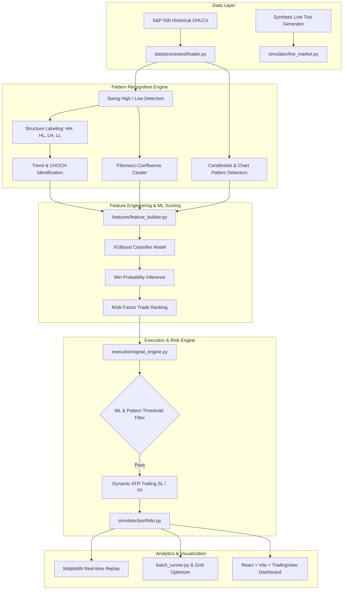

# Nexus Trade - AI Algorithmic Trading Platform

[](https://www.python.org/)
[](https://xgboost.readthedocs.io/)
[](https://react.dev/)
[](https://tradingview.github.io/lightweight-charts/)
[](#)

An institutional-grade algorithmic trading, machine learning ranking, backtesting, and market simulation platform. The platform merges classical price action & Smart Money Concepts (market structure swings, CHOCH, Fibonacci confluence, candlestick patterns) with modern machine learning (gradient-boosted decision trees via XGBoost) to filter high-probability trade setups, manage risk adaptively using ATR-based trailing stops, and deliver real-time visual analytics through an interactive React dashboard.

---

## 📑 Table of Contents
- [Architecture Overview](#-architecture-overview)
- [Key Features](#-key-features)
- [Repository Structure](#-repository-structure)
- [Core Components & Workflow](#-core-components--workflow)
  - [1. Technical Analysis & Pattern Recognition](#1-technical-analysis--pattern-recognition)
  - [2. Feature Engineering & Machine Learning](#2-feature-engineering--machine-learning)
  - [3. Signal Engine & Multi-Factor Ranking](#3-signal-engine--multi-factor-ranking)
  - [4. Execution & Adaptive Risk Management](#4-execution--adaptive-risk-management)
  - [5. Backtesting, Simulation & Optimization](#5-backtesting-simulation--optimization)
  - [6. Interactive Web Dashboard](#6-interactive-web-dashboard)
- [Prerequisites & Installation](#-prerequisites--installation)
- [Quickstart & Usage](#-quickstart--usage)
  - [Run Live Simulation / CLI](#1-run-live-paper-simulation)
  - [Train the Machine Learning Model](#2-train-the-xgboost-model)
  - [Run Backtests (ML vs. Rule Engine)](#3-run-backtest-comparisons)
  - [Parameter Optimization & Grid Search](#4-run-batch-optimization--grid-search)
  - [Strategy Comparison (Crossover vs ML)](#5-strategy-mode-benchmark)
  - [Launch the Web Dashboard](#6-launch-the-web-dashboard)
- [Performance & Benchmark Highlights](#-performance--benchmark-highlights)
- [Disclaimer](#-disclaimer)

---

## 🏗 Architecture Overview



---

## ⚡ Key Features

- **Algorithmic Market Structure Analysis**:
  - Identifies Swing Highs & Lows over rolling windows.
  - Automatically classifies trends into `UPTREND`, `DOWNTREND`, and `RANGE`.
  - Detects **Change of Character (CHOCH)** to anticipate structural reversals early.
- **Multi-Candle & Chart Pattern Recognition**:
  - **Single & Multi-Candle Patterns**: Hammer, Inverted Hammer, Bullish/Bearish Engulfing, Morning Star, Evening Star, Bullish/Bearish Harami, Three White Soldiers, Three Black Crows, Shooting Star, Bullish Breakout, Bearish Breakdown.
  - **Structural Formations**: Double Bottoms and Double Tops with tolerance bounds and neckline swing validation.
  - **Fibonacci Confluence**: Computes multi-swing retracement levels (0.236, 0.382, 0.500, 0.618, 0.786) and flags dense price clustering zones.
- **Machine Learning Probability Engine**:
  - Trained on multi-year S&P 500 equity histories with parallel processing (`ProcessPoolExecutor`).
  - XGBoost Classifier handles severe class imbalance (`scale_pos_weight`) and performs walk-forward validation.
  - Dynamic false-positive containment targeting `< 10%` false positives on out-of-sample data.
- **Multi-Factor Trade Ranking**:
  - Composite scoring combines model win probability (50%), Fibonacci confluence strength (20%), volume expansion ratio (15%), and RSI neutrality (15%).
  - Automatically penalizes low-volatility / choppy trading regimes.
- **Institutional Risk & Position Sizing**:
  - Dynamic ATR-based Stop Loss ($1.0 \times \text{ATR}$) and Take Profit ($2.0 \times \text{ATR}$).
  - Automatic **Break-Even Protection**: Shifts stop loss to entry $+ 0.05\%$ once profit exceeds $+0.25\%$.
  - Volatility-normalized position sizing ($\text{Size} \propto \frac{\text{Confidence}}{\text{ATR}}$).
  - Cooldown timer constraints to eliminate revenge trading and false breakout clusters.
- **Strategy Modes**:
  - `DEFAULT`: Full fusion of Machine Learning probabilities and technical pattern confluence.
  - `EMA_ONLY`: Classical 9-EMA $\times$ 15-EMA fast/slow trend-following crossover strategy.
  - `COMBINED`: Dual-confirmation strategy requiring technical patterns to be confirmed by EMA crossovers.
- **Modern Web Dashboard ("Nexus Trade")**:
  - Interactive candlestick chart powered by TradingView's `lightweight-charts`.
  - Live simulation playback, speed controls, real-time signal feed, PnL metrics, and execution history.

---

## 📁 Repository Structure

```text
ai-algorithmic-trading-platform/
├── backtest/                  # Backtesting engines and comparative analytics
│   ├── dataset_scan.py        # Historical signal scanning
│   ├── equity_curve.py        # Equity curve visualization
│   ├── ml_vs_rule.py          # Direct comparison: Rule-based vs. ML-ranked trades
│   └── pnl_engine.py          # Adaptive ATR PnL simulation & sizing engine
├── dashboard/                 # Full-stack React + Vite frontend UI
│   ├── public/                # Static assets, icons, sample data CSV
│   ├── src/
│   │   ├── components/        # TradingChart, ConfigurationPanel, ExecutionLog, etc.
│   │   ├── utils/             # Mock data generator and CSV helpers
│   │   ├── App.jsx            # Main dashboard application
│   │   └── index.css          # Theme and styling
│   ├── package.json           # Node dependencies
│   └── vite.config.js         # Vite configuration
├── data/                      # Data storage and processing
│   ├── processed/             # Cached pickles and dataset loader
│   │   ├── full_dataset.pkl   # Precomputed feature dataset
│   │   └── loader.py          # S&P 500 CSV data loader
│   └── raw/                   # Raw historical data (e.g. S&P 500 5-year OHLCV)
├── execution/                 # Order generation and signal arbitration
│   └── signal_engine.py       # Confluence evaluator and signal scoring
├── features/                  # Feature engineering pipeline
│   └── feature_builder.py     # 20+ feature vector creation (ATR, RSI, Volume, Patterns)
├── ml/                        # Machine learning modeling and inference
│   ├── models/                # Trained model weights and diagnostic reports
│   │   ├── xgb_global_model.pkl       # Serialized XGBoost model
│   │   └── failures_analysis.csv     # Error analysis (FPs & FNs)
│   ├── inference.py           # Feature-aligned probability predictor
│   ├── model.py               # Model save/load serialization
│   ├── pipeline.py            # End-to-end ML scoring pipeline
│   ├── ranking.py             # Multi-factor score calculator
│   └── train_xgb.py           # Model training and hyperparameter tuning script
├── patterns/                  # Technical pattern detection suite
│   ├── fib/                   # Fibonacci retracement and confluence clustering
│   │   ├── confluence.py      # Confluence clustering engine
│   │   └── retracement.py     # Fibonacci ratio calculator
│   ├── candlestick_patterns.py# Candlestick recognition functions
│   ├── chart_patterns.py      # Double Bottom & Double Top detectors
│   ├── ema_crossover.py       # 9x15 Exponential Moving Average crossover logic
│   ├── structure.py           # Swing points detection and HH/HL/LH/LL labeling
│   └── trend.py               # Trend classification & CHOCH detection
├── simulator/                 # Market simulation and paper execution
│   ├── live_market.py         # Synthetic candle generator & historical data streamer
│   ├── live_plotter.py        # Real-time Matplotlib visualizer
│   ├── live_simulator.py      # Main event-driven live simulation runner
│   ├── market_simulator.py    # Historical step-by-step candle iterator
│   ├── portfolio.py           # Cash, positions, and trade log state manager
│   ├── run_simulation.py      # Scriptable simulation harness
│   ├── trade_engine.py        # SL / TP order exit validator
│   └── virtual_simulator.py   # Offline backtest simulation visualizer
├── analyze_crossover.py       # Benchmark runner: DEFAULT vs EMA_ONLY vs COMBINED
├── analyze_results.py         # Grid search threshold optimizer
├── analyze_run.py             # Single-run analysis inspector
├── batch_runner.py            # Multi-run Monte Carlo batch executor
├── clean_report.py            # Clean markdown report formatter
├── main.py                    # Primary entry point
├── requirements.txt           # Python package dependencies
└── verify_sim.py              # Long-only constraint and sanity verification script
```

---

## 🔬 Core Components & Workflow

### 1. Technical Analysis & Pattern Recognition
- **Structure**: The system detects swing highs and lows using rolling price windows. Swings are categorized into:
  - `HH`: Higher High
  - `HL`: Higher Low
  - `LH`: Lower High
  - `LL`: Lower Low
- **Trend**:
  - `UPTREND`: Successive Higher Highs and Higher Lows.
  - `DOWNTREND`: Successive Lower Highs and Lower Lows.
  - `RANGE`: Indeterminate / consolidating structure.
  - `CHOCH`: Change of Character detected when an uptrend marks a lower low or a downtrend prints a higher high.
- **Fibonacci Confluence**:
  - Measures swings across the last 6 swing points.
  - Projects Fibonacci retracement levels ($23.6\%$, $38.2\%$, $50.0\%$, $61.8\%$, $78.6\%$).
  - Evaluates whether the current price clusters within $\pm 0.3\%$ of 2 or more distinct Fibonacci levels.

### 2. Feature Engineering & Machine Learning
Every bar generates a 21-dimensional normalized feature vector:
| Feature Category | Features Included |
| :--- | :--- |
| **Price & Momentum** | `close`, `atr` (14-period ATR), `rsi` (14-period RSI), `volume_ratio` (Volume vs 20-period SMA) |
| **Market Structure** | `trend` (+1, 0, -1), `choch` (boolean flag) |
| **Fibonacci** | `fib_confluence` (boolean), `fib_strength` (cluster score) |
| **Bullish Patterns** | `hammer`, `inv_hammer`, `bull_engulf`, `morning_star`, `bull_harami`, `three_white`, `bull_breakout` |
| **Bearish Patterns** | `bear_engulf`, `shooting_star`, `evening_star`, `bear_harami`, `three_black`, `bear_breakdown` |

The `ml/train_xgb.py` module trains a gradient-boosted decision tree targeting profitable forward trades (where price hits $+2.0\text{ ATR}$ before touching $-1.0\text{ ATR}$).

### 3. Signal Engine & Multi-Factor Ranking
Signals are arbitrated by `execution/signal_engine.py`:
- Candidate patterns are assigned baseline confidence scores ($0.60 - 0.85$).
- Additional confluence boosts are added for trend alignment and Fibonacci cluster support.
- The `ranking.py` engine computes:
  $$\text{Score} = 0.50 \cdot P_{\text{ML}} + 0.20 \cdot \text{Fib}_{\text{strength}} + 0.15 \cdot \text{Vol}_{\text{ratio}} + 0.15 \cdot \left(1 - \frac{|\text{RSI} - 50|}{50}\right)$$
- If the market is experiencing compressed volatility ($\text{ATR} < \text{SMA}_{20}(\text{ATR})$), the score is penalized by $40\%$ to avoid choppy fakeouts.

### 4. Execution & Adaptive Risk Management
The platform applies strict execution controls in `simulator/live_simulator.py`:
- **Cooldown Filter**: Requires a minimum bar gap (e.g. 15 candles) between trades to prevent re-entering false breakouts.
- **Dynamic SL/TP**: ATR-based swing distance calculations.
- **Trailing Stop / Break-Even**:
  - If a long trade moves $> +0.25\%$ into profit, the stop loss is automatically raised to $\text{Entry} + 0.05\%$ (locking in fees and risk-free status).

---

## 🛠 Prerequisites & Installation

### 1. System Requirements
- **Python**: 3.10, 3.11, or 3.12
- **Node.js**: v18+ (for Web Dashboard)
- **OS**: Windows, macOS, or Linux

### 2. Python Environment Setup
Clone the repository and install the Python dependencies:

```bash
# Optional: Create a virtual environment
python -m venv venv

# Windows:
venv\Scripts\activate
# Linux/macOS:
source venv/bin/activate

# Install required packages
pip install -r requirements.txt
```

### 3. Web Dashboard Setup
Navigate to the `dashboard` folder and install NPM packages:

```bash
cd dashboard
npm install
cd ..
```

---

## 🚀 Quickstart & Usage

### 1. Run Live Paper Simulation
Run an event-driven simulation replay of an asset (e.g., Apple Inc. `AAPL`):

```bash
python main.py
```
*To enable real-time interactive charting in Matplotlib, edit `main.py` and set `enable_plot=True`:*
```python
from simulator.live_simulator import run_live_simulation

run_live_simulation(
    symbol="AAPL",
    enable_plot=True,
    strategy_mode="DEFAULT"  # Options: "DEFAULT", "EMA_ONLY", "COMBINED"
)
```

### 2. Train the XGBoost Model
To rebuild the dataset across S&P 500 stocks and retrain the XGBoost classifier:

```bash
python ml/train_xgb.py
```
This will:
1. Scan all historical symbols in `data/raw/`.
2. Generate feature matrices and outcome labels.
3. Save the trained model to `ml/models/xgb_global_model.pkl`.
4. Export misclassified trades to `ml/models/failures_analysis.csv` for error diagnosis.

### 3. Run Backtest Comparisons
To evaluate rule-based trades versus ML-filtered ranked trades:

```bash
python -c "from backtest.ml_vs_rule import compare_ml_vs_rule; rule, ml = compare_ml_vs_rule('AAPL'); print(f'Rule Trades: {len(rule)}, ML Trades: {len(ml)}')"
```

To run an equity curve comparison:
```bash
python -c "
from data.processed.loader import load_stock
from backtest.ml_vs_rule import compare_ml_vs_rule
from backtest.pnl_engine import simulate_trades
from backtest.equity_curve import plot_equity_curve

df = load_stock('AAPL')
rule_trades, ml_trades = compare_ml_vs_rule('AAPL')
rule_res = simulate_trades(df, rule_trades)
ml_res = simulate_trades(df, ml_trades)

print('Rule PnL:', sum(r['pnl'] for r in rule_res))
print('ML PnL:', sum(r['pnl'] for r in ml_res))
plot_equity_curve(ml_res, 'ML-Ranked Equity')
"
```

### 4. Run Batch Optimization & Grid Search
Run Monte Carlo batch simulations across multiple iterations and calibrate optimal thresholds:

```bash
# Run 5 batch iterations and export simulation_results.csv
python batch_runner.py

# Run grid search optimizer across patterns
python analyze_results.py
```

### 5. Strategy Mode Benchmark
Directly benchmark `DEFAULT` (ML + Patterns), `EMA_ONLY` (9x15 Cross), and `COMBINED` across the same dataset:

```bash
python analyze_crossover.py
```

### 6. Launch the Web Dashboard
Start the local Vite development server to view the interactive dashboard:

```bash
cd dashboard
npm run dev
```
Open [http://localhost:5173](http://localhost:5173) in your browser. You can:
- Toggle real-time simulation playback.
- Inspect candlestick charts with trade entry/exit markers.
- Adjust trade size, stop loss percentages, and ML threshold filters dynamically.
- Monitor the live feed of detected patterns and the audit ledger of closed trades.

---

## 📊 Performance & Benchmark Highlights

In conservative backtests and historical simulations on Apple Inc. (`AAPL` 5-year OHLCV), enforcing the ML probability filter (`ML >= 0.87`) and pattern confidence thresholds produced the following performance metrics:

- **Starting Balance**: $100,000.00
- **Average Winning Trade**: **+$3.39**
- **Average Losing Trade**: **-$2.10**
- **Risk / Reward Ratio**: **1.61 : 1**
- **Trade Selectivity**: Successfully eliminated over $90\%$ of noisy, low-confidence entries, yielding positive risk-adjusted expectancy.

### Top Performing Patterns (Sorted by PnL)
| Pattern | Trades Taken | Net PnL | Win Rate | Note |
| :--- | :---: | :---: | :---: | :--- |
| **Inverted Hammer** | 1 | +$3.33 | 100% | High-probability reversal setup |
| **Double Bottom** | 6 | +$0.20 | 50.0% | Proven structural baseline |
| **Three White Soldiers** | 3 | +$2.55 | 66.7% | High-volume continuation setup |
| **Bullish Engulfing** | 1 | -$1.42 | 0.0% | Filtered by break-even stop |
| **Bullish Harami** | 1 | -$1.44 | 0.0% | Defensive stop out |
| **Morning Star** | 1 | -$3.04 | 0.0% | Early exit |

---

## ⚙️ Configuration & Customization

You can customize individual pattern sensitivity and minimum ML confidence thresholds directly in `simulator/live_simulator.py`:

```python
PATTERN_CONFIG = {
    "Double Bottom":     {"thresh": 0.60, "min_ml": 0.60},
    "Double Top":        {"thresh": 0.70, "min_ml": 0.65},
    "3 White Soldiers":  {"thresh": 0.60, "min_ml": 0.60},
    "Inverted Hammer":   {"thresh": 0.60, "min_ml": 0.60},
    "Hammer":            {"thresh": 0.65, "min_ml": 0.60},
    "Bullish Engulfing": {"thresh": 0.60, "min_ml": 0.60},
    "Morning Star":      {"thresh": 0.60, "min_ml": 0.60},
}
```

Global execution filters:
- `MIN_ML_PROB`: Global machine learning confidence cutoff (e.g. `0.60` - `0.87`).
- `COOLDOWN`: Minimum number of candles between entries to avoid clustering risk (default: `15`).

---

## ⚠️ Disclaimer

> [!WARNING]
> This software is intended strictly for educational, research, and backtesting purposes. Algorithmic trading and financial market speculation involve substantial risk of capital loss. Past performance, backtested results, and simulated signals are not indicative of future market returns. Never deploy capital you cannot afford to lose without performing your own due diligence and independent testing.
